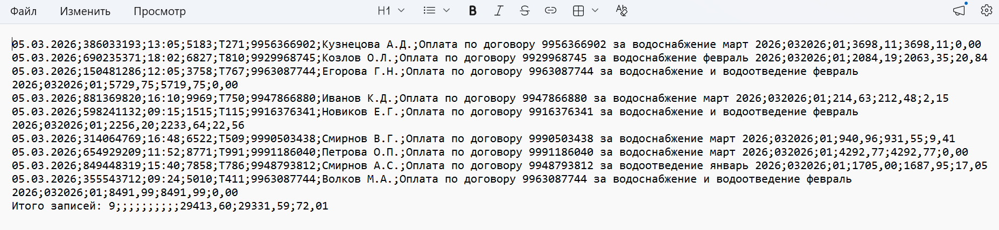
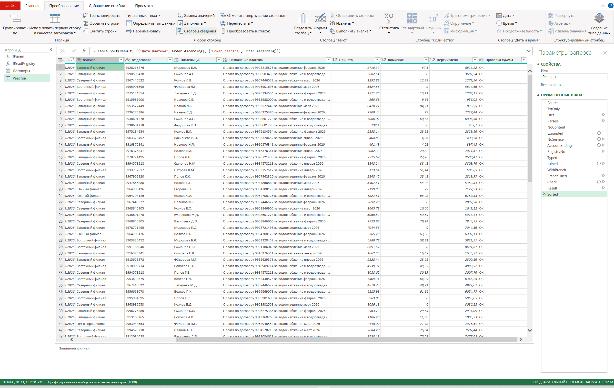
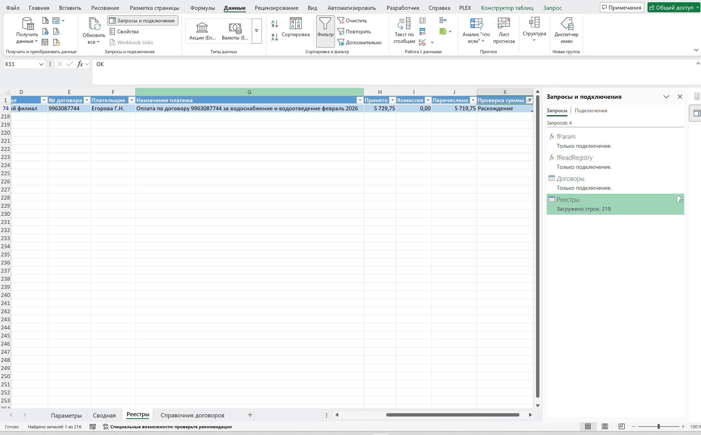
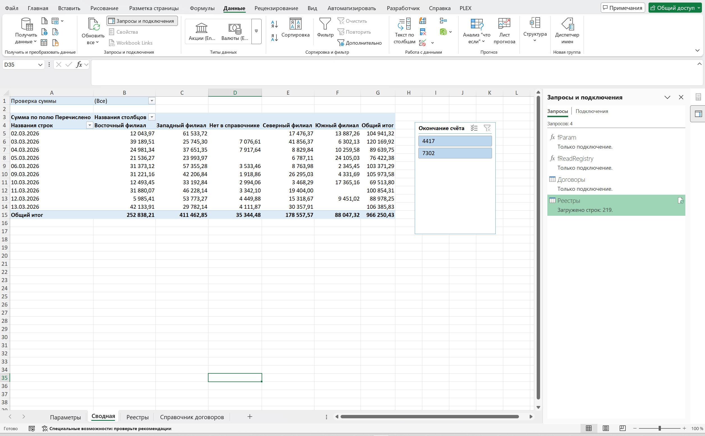

# Реестры платежей → отчёт на Power Query

Платёжные агенты присылают реестры принятых платежей текстовыми файлами: по файлу на счёт и день. Этот проект на Excel 365 и Power Query собирает все реестры из папки в одну таблицу, определяет филиал по справочнику договоров, проверяет суммы и строит сводную по дням и филиалам. Новые файлы обрабатываются кнопкой «Обновить всё».

Задача взята из рабочей практики: формат реестров повторяет настоящий («новый договор»), но **все данные выдуманы** генератором из этого репозитория. Номера договоров начинаются с `99`, плательщики и суммы случайные.

## Вход: реестр

| Свойство | Значение |
|---|---|
| Файл | `<окончание счёта>_<номер реестра>.txt`, например `4417_1207.txt` |
| Формат | текст, разделитель `;`, кодировка Windows-1251, 13 полей, без кавычек |
| Нужные поля | 1 дата платежа, 6 № договора, 7 плательщик, 8 назначение, 11 принято, 12 перечислено, 13 комиссия |
| Служебная строка | в конце файла `Итого записей: N;…` с суммами |

## Как устроено

| Шаг | Что делает |
|---|---|
| Папка | `Folder.Files` по пути с листа «Параметры»: только `.txt`, скрытые файлы пропускаются |
| Разбор | функция `fReadRegistry` читает файл (`;`, 1251, 13 полей) |
| Поля | из 13 полей остаются 7, им даются понятные имена |
| Служебные строки | строки `Итого…` и пустые отбрасываются |
| Имя файла | из `4417_1207.txt` получаются «Окончание счёта» = `4417` и «Номер реестра» = `1207` |
| Типы | даты и суммы приводятся с русской локалью (запятая в дробной части) |
| **Филиал** | слияние (`Table.NestedJoin`) со **справочником договоров** на отдельном листе; договора нет в справочнике → «Нет в справочнике» |
| **Проверка суммы** | `Принято − Перечислено = Комиссия` с точностью до копейки → «ОК» или «Расхождение» |

**Почему справочник, а не условия.** В рабочей версии филиал определялся цепочкой из сотни условий вида «если договор = … то филиал …», и каждый новый договор означал правку кода. Здесь договоры и филиалы лежат таблицей на листе: новый договор добавляется строкой, а код не меняется. Номера договоров хранятся как текст, чтобы не терялись ведущие нули.

## Контроль

В данных намеренно оставлены две ошибки, которые конвейер должен поймать:

| Ошибка | Что видно в результате |
|---|---|
| 2 договора не внесены в справочник | 9 платежей с филиалом «Нет в справочнике», в сводной это отдельный столбец |
| в одном платеже перечислено на 10 ₽ меньше, чем принято минус комиссия | 1 строка «Расхождение» |

## Результат

Сводная «Перечислено» по дням и филиалам, срез по счёту, фильтр по проверке суммы. Итог по 20 реестрам: 219 платежей, 966 250,43 ₽.

## Состав

| Путь | Что это |
|---|---|
| `Реестры.xlsx` | книга: «Параметры», «Справочник договоров», «Реестры» (результат запроса), «Сводная» |
| `powerquery/*.m` | код четырёх запросов: `fParam`, `fReadRegistry`, `Договоры`, `Реестры` |
| `data/registries/` | 20 выдуманных реестров (10 рабочих дней × 2 счёта) |
| `data/contracts.csv` | справочник: 40 договоров → 4 филиала |
| `generator/generate_registries.py` | генератор данных; фиксированный seed, файлы при каждом запуске одинаковые |

## Как запустить

1. Скачайте репозиторий целиком и откройте `Реестры.xlsx`.
2. Путь к папке с реестрами на листе «Параметры» вычисляется формулой от расположения книги, править его не нужно. В английском Excel замените в формуле аргумент `"имяфайла"` на `"filename"`.
3. «Данные → Обновить всё».

Уровни конфиденциальности источников в книге отключены: запрос соединяет файлы из папки с таблицей из книги, и без этого Power Query выдаёт `Formula.Firewall`.

Пересоздать данные: `python3 generator/generate_registries.py` (нужен только Python 3, без пакетов).

## Стек

Excel 365, Power Query (M), сводные таблицы, срезы, Python 3 для генерации данных.

## Автор

Валерий Кравченко (Valerii Kravchenko). Больше 10 лет автоматизирую обработку данных и отчётность в Excel и Power Query, сейчас перехожу в Java-разработку. Другие проекты: [github.com/ValeriiKravchenko](https://github.com/ValeriiKravchenko).
